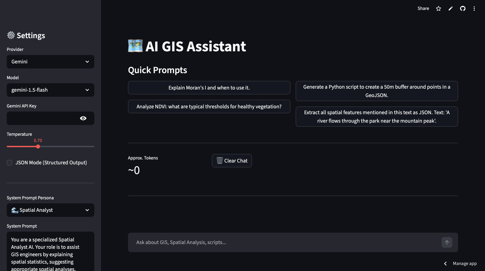

# 🗺️ AI GIS Assistant

An AI-powered GIS Assistant built with Streamlit to help GIS engineers with spatial analysis, scripting, and understanding spatial concepts.

## 🚀 Features
- **Multi-Provider Support**: Choose between Google Gemini, Groq, and OpenRouter models.
- **Customizable Persona**: Built-in 'Spatial Analyst' persona with the ability to define custom system prompts.
- **Streaming Responses**: Real-time text generation.
- **Multimodal**: Support for image uploads when using Google Gemini Vision models.
- **Structured Output**: JSON mode toggle for structured data extraction.
- **Chat Management**: Persistent history, clear chat, token estimation, and Markdown/PDF export.
- **Quick Prompts**: Preset GIS-related questions to get started quickly.

## 🛠️ Setup Instructions

1. Clone this repository.
2. Install the required dependencies:
   ```bash
   pip install -r requirements.txt
   ```
3. (Optional) Set up your `.env` file based on `.env.example`.
4. Run the Streamlit app:
   ```bash
   streamlit run app.py
   ```
5. Enter your API keys directly in the app sidebar to start chatting.

## 📸 Screenshots


## 🌐 Live Demo
[Launch the AI GIS Assistant App on Streamlit Cloud](https://spatial-analyst-ai-02.streamlit.app/)